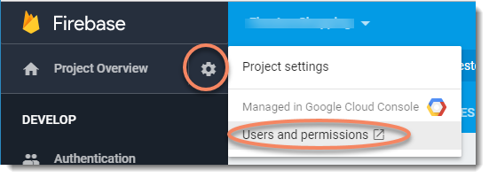
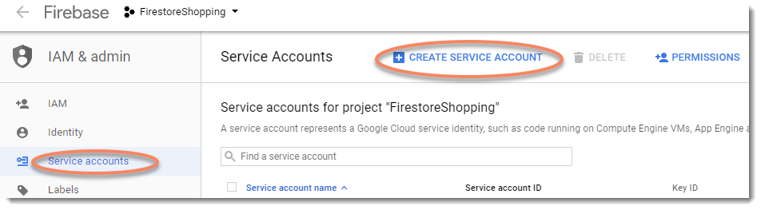
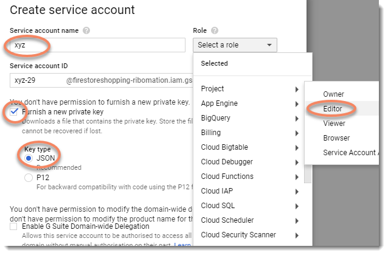

firestore-transfer
==================

Simple scripts for export / import of Google FireStore data.

Installation
============
For the time being, this repo is not registered in the NPM repo,
hence you need to use the full github url.
Eventually, when the scripts have been in use for a while I will
register it in the NPM repo.

    npm install --global https://github.com/ribomation/firestore-transfer

Usage
=====

    firestore-export <common opts> [--keys]
    firestore-import <common opts> --json [file] | --yaml [file]

Common Options
==============
All scripts need the following three option items

* Google service-key: `--auth <service-key file>`
* Firestore database name: `--db <db name>`
* Collection name: `--col <colletion name>`

Generating a Service Key
------------------------
Unless, you already have a service-key, you need to obtain one from the
firebase console.

1. Open "Users and permssions" at the "Project settings".

2. Choose "CREATE SERVICE ACCOUNT".

3. Create a service account, give it a name, a role as editor and let Google
generate a new key in JSON format.

4. Save the `service-key.json` in a firestore project directory.

Using a `service-key.json` file
-------------------------------
Once you have this file, you can choose to provide it in two different ways:

* _Explicitly_: `--auth path/to/service-key.json`
* _Implicitly_: The scripts will search for a file named `service-key.json`
in the following relative directories: `['.', '..', '../..']`.

Firestore Database Name
-----------------------
You must provide db name. However, you can choose to provide it in 
two different ways:

* _Explicitly_: `--db my-fsdb-name`
* _Implicitly_: The scripts will search for a file named `.firestorerc`
in the following relative directories: `['.', '..', '../..']`. If the file 
was found, it will use the value of `projects.default` as the db name.

Firestore Collection Name
-------------------------
You must provide the name for a collection and it must be given explicitly.

*  _Explicitly_: `--col my-fsdb-collection`

Export
======
The export script downloads the full content of a collection and prints
it out as one JSON document.

You can optionally specify that you only want the document keys.

* _Just the keys_: `--keys`

### Sample usage

    firestore-export --col users
    firestore-export --col users --keys

Import
======
The import script uploads a set of documents to the given collection.
The file format can be either JSON of YaML. However, one and only one
of the options below can be used.

* _JSON_: `--json path/to/data.json`
* _YaML_: `--yaml path/to/data.yml`

If the filename is absent, then the content will be loaded from stdin.

    cat path/to/data.yml | firestore-import --col my-data --yaml

Import Data Format
------------------
The import data file can be either an array or an object literal.

### Array Format: `[doc1, doc2, ...]`
Each document will be pushed to the collection and be given a generated
key.

### Object Format: `{key1:doc1, key2:doc2, ...}`
Each document will create/update the given key.

